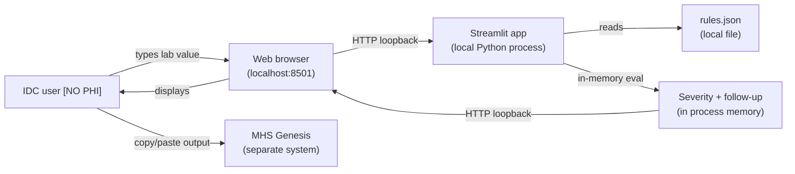
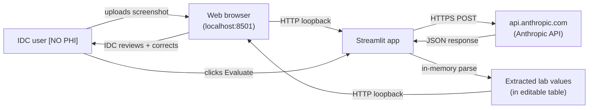
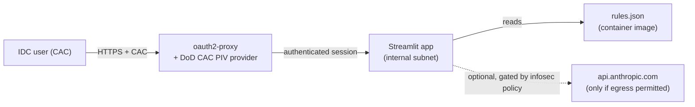

# IDC Lab Assistant — Data Flow Diagram

> **DRAFT — for ISSO / ISSM submission.** Diagrams below describe
> the tool's actual data flows as of commit `[GIT SHA]`. The mermaid
> source renders in any GitHub / GitLab / VS Code preview; the
> ASCII version is for documents that don't render mermaid.

## Scope

This document describes every place data enters or leaves the IDC
Lab Assistant. It is intentionally exhaustive — including modes that
many users will never invoke — so the reviewer can see the full
attack surface in one place.

## Data classification (per system policy)

The application's user-facing PHI banner enforces:

- **De-identified test data only.** No patient PHI/PII is to be
  entered into any input field, pasted into the text area, or
  uploaded as a screenshot.
- The PHI banner is displayed prominently at the top of every
  session and is restated in the screenshot-upload tab caption.

Below, every node is annotated with `[NO PHI]` to reinforce that the
in-scope data is synthetic / de-identified test values, not real
patient data.

## Mode 1 — Default operation (Manual entry, Paste lab text)



**ASCII equivalent:**

```
[IDC user] -- types lab value -->
   [Browser @ localhost:8501] -- HTTP loopback -->
      [Streamlit Python process]
         |- reads rules.json (local file)
         |- evaluates in-memory (no I/O)
      [Streamlit Python process] -- HTTP loopback -->
   [Browser]
[IDC user] <-- displays text output --
[IDC user] -- manual copy/paste --> [MHS Genesis (out-of-band)]
```

**Network egress:** **None.** The application binds to `localhost`
by default. No outbound traffic of any kind.

**Files written:** **None.** No persistent storage.

**Data retention:** None. State exists only in process memory; it
is destroyed when the user closes the browser tab or the host
process.

## Mode 2 — Upload screenshot (optional feature)

This mode is only invoked when the IDC actively clicks the "Upload
screenshot" tab and uploads an image. The PHI banner forbids
uploading screenshots that contain PHI/PII.



**ASCII equivalent:**

```
[IDC user] -- uploads de-identified screenshot -->
   [Browser @ localhost:8501] -- HTTP loopback -->
      [Streamlit Python process]
         |- base64-encodes image bytes
         |- HTTPS POST to api.anthropic.com (Anthropic Messages API)
         |- receives structured JSON response
         |- maps to allowlisted lab IDs
      [Streamlit Python process] -- HTTP loopback -->
   [Browser]
[IDC user] -- reviews/corrects extracted values --> [Evaluate]
```

**Network egress:**

| Destination | Protocol | When | Payload | Volume |
|---|---|---|---|---|
| `api.anthropic.com` | HTTPS (TLS 1.2+) | Once per "Extract" click | Base64-encoded screenshot + system prompt + JSON-schema constraint | ~one image per click; typical PNG screenshot 100 KB – 2 MB |

**Authentication to Anthropic API:** Bearer token (`ANTHROPIC_API_KEY`).
Two delivery options, both implemented:

1. **Environment variable** on the host (single-tenant deploy; the
   deploying organization pays for usage).
2. **Sidebar text input** (per-IDC; the IDC pastes their own key
   into a password-masked field — never persisted, lives only in
   browser session memory).

**Anthropic data-handling**: per Anthropic's
[Trust Center](https://trust.anthropic.com), API inputs are not
used to train models by default. PHI is **not appropriate** for the
Anthropic API regardless — the application's PHI banner enforces
this independently.

**Disabling this mode**: not providing an API key disables the
"Extract" button; the rest of the application continues to work
without it.

## Mode 3 — Hosted multi-user deployment (NOT YET IMPLEMENTED)

For reference — if the application were deployed behind a
CAC-authenticated reverse proxy on controlled infrastructure, the
data flow would extend as follows. **The reverse-proxy + auth layer
is not in this code base today**; this section documents the
intended pattern for a future hosted variant.



**Network controls** (proposed for the hosted variant):

- TLS termination at the proxy
- Outbound egress to `api.anthropic.com` either **denied** (screenshot
  mode disabled) or routed through an outbound proxy that records the
  full request/response per audit policy
- No inbound paths from the internet — application sits inside the
  enclave

## Data category summary

| Category | Default mode | Screenshot mode | Hosted variant |
|---|---|---|---|
| PHI/PII | **None** (forbidden by banner + reaffirmed in tab caption) | **None** | **None** |
| User credentials | None | API key (per-user, in-memory only) | CAC token (proxy-managed) |
| Synthetic / de-identified lab values | In-process memory only | In-process memory only | In-process memory only |
| Persistent storage | **None** | **None** | **None** |
| Application logs | stdout/stderr only; no patient data | stdout/stderr only | per host policy |

## Threats and mitigations

| Threat | Mitigation |
|---|---|
| User pastes real PHI despite banner | Banner is unmissable; tab caption restates; user training covered in submission packet |
| Screenshot contains PHI metadata (EXIF, embedded text) | Images are base64-encoded and transmitted to a 3rd party; mitigation is the policy ban + IDC training. Future enhancement: strip EXIF client-side before upload. |
| Anthropic API key leakage | Key is never logged; sidebar input is `type="password"`; key lives only in-memory. Recommend: per-IDC keys not shared host keys. |
| Network MITM on Anthropic call | TLS 1.2+ enforced by Anthropic; SDK validates certificates. |
| Local file tampering with `rules.json` | Out of scope — host workstation security is the relevant boundary. CI-pinned commit hash documented in submission. |
| Dependency supply-chain compromise | Pinned versions in `requirements.txt`; SBOM provided in `03-software-bill-of-materials.md`; recommend periodic `pip-audit` runs. |
